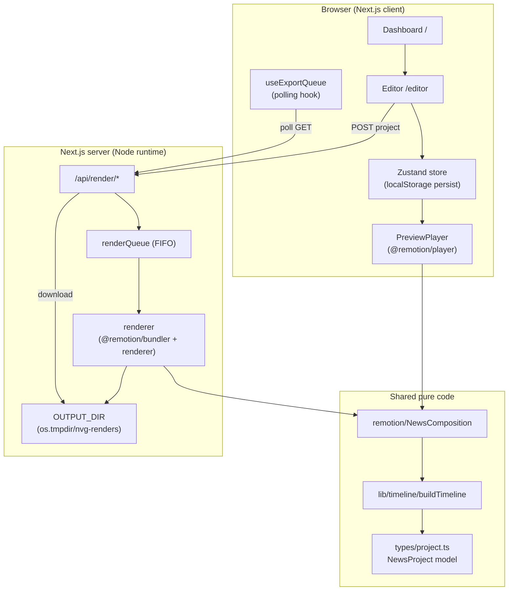
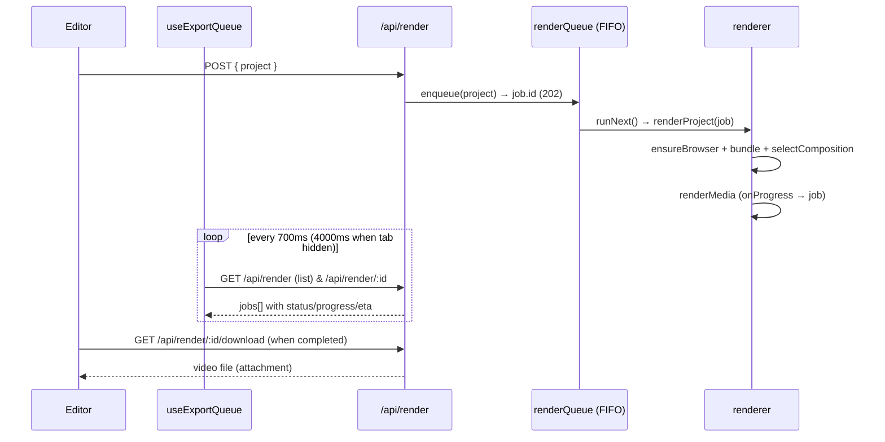
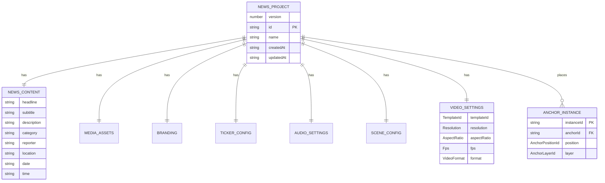

# PROJECT_DOCUMENTATION.md

> **Single source of truth** for the News Video Generator. Written so a new developer
> or AI assistant can understand the entire project without reading all the source code.
>
> **Keep this file synchronized with the codebase.** Whenever features, architecture,
> business logic, the domain model, or the API surface change, update the relevant
> section _and_ the [Changelog](#19-changelog). Anything unknown or unverified is
> marked **TODO** rather than guessed.

**Last verified against code:** 2026-07-10

---

## Table of Contents

1. [Project Overview](#1-project-overview)
2. [Technology Stack](#2-technology-stack)
3. [Folder Structure](#3-folder-structure)
4. [Application Flow](#4-application-flow)
5. [Feature Documentation](#5-feature-documentation)
6. [Database Documentation](#6-database-documentation)
7. [API Documentation](#7-api-documentation)
8. [Component Documentation](#8-component-documentation)
9. [Configuration](#9-configuration)
10. [Business Logic](#10-business-logic)
11. [Security](#11-security)
12. [Performance](#12-performance)
13. [Deployment](#13-deployment)
14. [Troubleshooting](#14-troubleshooting)
15. [Testing](#15-testing)
16. [Coding Standards](#16-coding-standards)
17. [Future Plans](#17-future-plans)
18. [AI Context](#18-ai-context)
19. [Changelog](#19-changelog)
20. [Developer Notes](#20-developer-notes)

---

## 1. Project Overview

| Field | Value |
|---|---|
| **Project name** | News Video Generator (repo dir: `हिमाचलप्रदेश.com`, npm name `news-video-generator`) |
| **Version** | `0.1.0` |
| **Purpose** | Generate professional broadcast-style **news videos** from simple form input, using only **deterministic templates and rendering logic**. |
| **Key constraint** | **No AI, no LLM, no external generative services.** Every frame is produced by React + Remotion compositions driven purely by user data. This is a hard, defining product rule. |

### Purpose & Objectives

Turn a small amount of editorial input (headline, description, reporter, branding,
media) into a finished, downloadable news video (MP4/WebM) — with a live preview that
is **pixel-for-pixel identical** to the exported file.

### Problems the project solves

- Producing broadcast-quality news videos normally needs video editors and motion
  designers. This app reduces it to filling a form.
- **Determinism / reproducibility:** the same project always renders the same video.
  No probabilistic AI output, no per-render drift.
- **Offline & self-contained:** rendering runs locally via Remotion's bundled
  compositor (no system FFmpeg, no cloud generative APIs).
- **Extensibility:** new templates and virtual presenters ("anchors") are added by
  registration, not by touching the render pipeline.

### Target users

News channels, digital publishers, regional/local news creators (the repo name and
default anchors reflect a Himachal Pradesh / India regional focus), social media teams
needing fast vertical (9:16) or square (1:1) news clips.

### Key features

- **Template engine** — 8 registry-driven templates (Breaking, Modern, Business,
  Minimal, Cinematic Prime, Live Bulletin, Data Pulse, Sports Spotlight).
- **Live preview** via `@remotion/player` that matches the export exactly.
- **Scene/timeline engine** — intro → headline → body paragraphs (unlimited) → outro,
  with fade/slide/wipe/none transitions.
- **Server-side rendering** to MP4 (H.264) / WebM (VP8) at 720p/1080p, 16:9 / 9:16 /
  1:1, 30/60 fps.
- **Render queue** with real lifecycle states, true progress %, elapsed + ETA, cancel,
  retry, download.
- **Anchor Engine** — deterministic parametric SVG virtual presenters (8 of them),
  multi-anchor per project, scene-scoped animation, lazy loading.
- **Branding** (colors, fonts, watermark, channel name, logo), **ticker**, **audio
  mixer** (background music + intro/outro stings with fades).
- **Save/load** project library persisted to `localStorage`.

### High-level architecture



**Central idea:** `buildTimeline(project)` + `<NewsComposition>` are shared pure code
used by _both_ the live preview and the server renderer, which is what guarantees
preview == export.

### Current development status

All three planned phases are marked **done** in the README:

- **Phase 1 (done):** architecture, dashboard, editor, live preview, template engine,
  modular animations, ticker, branding.
- **Phase 2 (done):** scene/timeline engine, server-side MP4/WebM export, real queue +
  progress, asset manager, audio system, aspect ratios, error handling + retry,
  save/load.
- **Phase 3 (done):** modular Anchor Engine — 8 anchors, multi-anchor, layers,
  deterministic talking, scene-scoped timeline integration, lazy loading.

Repo is a fresh git repository on branch `main` with **no commits yet** and no test
suite (see [Testing](#15-testing)).

### Roadmap

See [Future Plans](#17-future-plans). Next up: more templates, timeline editing UI,
phoneme-accurate voice-over, parallel export processing.

---

## 2. Technology Stack

| Layer | Technology | Version (from `package.json`) | Notes |
|---|---|---|---|
| **Language** | TypeScript | `^5.7.3` | `strict: true` |
| **Framework** | Next.js (App Router) | `15.1.6` | RSC + route handlers |
| **UI runtime** | React / React DOM | `19.0.0` | |
| **Styling** | Tailwind CSS | `^3.4.17` | + `autoprefixer ^10.4.20`, `postcss ^8.5.1` |
| **Video engine** | Remotion | `^4.0.267` | compositions rendered by React |
| **Live preview** | `@remotion/player` | `^4.0.267` | browser-only, mounted via dynamic import |
| **Transitions** | `@remotion/transitions` | `^4.0.486` | fade / slide / wipe presentations |
| **Server render** | `@remotion/bundler`, `@remotion/renderer` | `^4.0.486` | native, server-only; bundled compositor |
| **State** | Zustand | `^5.0.3` | `persist` middleware → `localStorage` |
| **Package manager** | npm | — | `package-lock.json` present |
| **Runtime types** | `@types/node ^22`, `@types/react ^19`, `@types/react-dom ^19` | | |

### Explicitly NOT used

| Category | Status |
|---|---|
| **Backend / DB / ORM** | **None.** No database. Persistence is browser `localStorage` (client) + temp files on disk (rendered videos). See [Database Documentation](#6-database-documentation). |
| **Authentication** | **None.** No login, users, sessions, or roles. See [Security](#11-security). |
| **AI models / LLMs** | **None — by design and product rule.** All output is deterministic. |
| **External services / third-party APIs** | **None.** Fully offline/self-contained. |
| **Hosting / deployment config** | **TODO** — no Dockerfile, CI config, or deploy manifests exist in the repo yet. |

### Notable third-party libraries

- **Remotion** family — the entire rendering foundation (preview + export + transitions).
- **Zustand** — the only state library; `persist` + `createJSONStorage(localStorage)`.

---

## 3. Folder Structure

Everything lives under [`src/`](src/). Path alias `@/*` → `./src/*` (see
[`tsconfig.json`](tsconfig.json)).

```
src/
  app/                      Next.js App Router routes + API
    page.tsx                "/"  → <Dashboard/>
    editor/page.tsx         "/editor" → <Editor/>
    layout.tsx              Root HTML shell + <metadata>
    globals.css             Tailwind entry + global styles
    api/render/             Render REST API (route handlers, Node runtime)
      route.ts              POST start · GET list
      [id]/route.ts         GET status · POST cancel/retry · DELETE remove
      [id]/download/route.ts GET stream finished video
  components/
    dashboard/Dashboard.tsx Landing page: Create / Saved / Queue / Settings tabs
    editor/                 Editor shell, form, media upload, anchor panel
    preview/PreviewPlayer   Remotion Player live preview (ssr:false)
    export/ExportQueue      Queue UI: progress, stages, timings, actions
    ui/primitives.tsx       Dependency-free UI atoms (Button, Card, Input…)
  hooks/useMounted.ts       SSR-safe "is mounted" gate for persisted state
  lib/
    store/projectStore.ts   Zustand store — THE client state + persistence
    defaults.ts             createDefaultProject() + createId()
    format.ts               date/time/duration/bytes formatters
    file.ts                 fileToDataUrl()
    timeline/               buildTimeline() — frame-accurate scene engine + types
    assets/assetManager.ts  content-hash dedup + ref-counted asset store
    export/useExportQueue.ts Client polling hook over the render API
  types/project.ts          Domain model (NewsProject) — SINGLE SOURCE OF TRUTH
  remotion/
    NewsComposition.tsx     THE composition (shared by preview + renderer)
    Root.tsx                Registered <Composition> for server rendering
    index.ts                registerRoot entrypoint (Remotion bundle)
    constants.ts            NEWS_COMPOSITION_ID (Remotion-free, RSC-safe)
    theme.ts                Per-template background palette → resolved Theme
    SceneStage.tsx          Composes one scene + its anchors in z-order
    animations/presets.ts   Reusable frame-driven animation hooks
    templates/              Template engine: registry + one file per template
    scenes/                 intro/headline/body/outro scene components + registry
    components/             Persistent overlays: Background, Ticker, Logo,
                            Watermark, LowerThird, AudioLayer
  anchors/                  Anchor Engine (virtual presenters) — see §5
    types.ts                Anchor contract (metadata, instance, layers, state)
    registry/               THE anchor registry + cache + entry types
    animations/             state resolver (deterministic) + entry/exit
    components/             AnchorFigure (SVG rig), Renderer, Layer, placement
    factory.ts              createAnchorInstance(metadata)
    <name>/                 one folder per anchor package (8 total)
  server/                   Server-only render pipeline
    renderer.ts             bundle + selectComposition + renderMedia
    renderQueue.ts          in-process FIFO queue, one active render
    renderTypes.ts          RenderJob / RenderJobPublic + toPublic()
```

> **Note:** the task template mentions `/database`, `/scripts`, `/public`, `/utils`
> folders — **these do not exist** in this project. There is no database layer, no
> scripts dir, and no `public/` assets dir at time of writing (**TODO**: add if needed).

---

## 4. Application Flow

### 4.1 How the application starts

1. `npm run dev` → `next dev` boots the Next.js App Router (default port 3000; falls
   back to 3001+ if taken).
2. Root [`layout.tsx`](src/app/layout.tsx) renders the HTML shell and imports
   `globals.css`.
3. `/` renders [`<Dashboard/>`](src/components/dashboard/Dashboard.tsx);
   `/editor` renders [`<Editor/>`](src/components/editor/Editor.tsx).
4. The Zustand store hydrates from `localStorage` on the client. `useMounted()` gates
   any persisted-state rendering so SSR and first client render match (no hydration
   mismatch).

### 4.2 Routing

| Route | File | Renders |
|---|---|---|
| `/` | [`src/app/page.tsx`](src/app/page.tsx) | Dashboard |
| `/editor` | [`src/app/editor/page.tsx`](src/app/editor/page.tsx) | Editor |
| `GET/POST /api/render` | [`route.ts`](src/app/api/render/route.ts) | list / start render |
| `GET/POST/DELETE /api/render/[id]` | [`[id]/route.ts`](src/app/api/render/[id]/route.ts) | status / cancel-retry / remove |
| `GET /api/render/[id]/download` | [`download/route.ts`](src/app/api/render/[id]/download/route.ts) | stream file |

Client navigation between dashboard and editor uses `next/navigation`'s `useRouter`.

### 4.3 Authentication flow

**None.** There is no auth. All routes are public. (See [Security](#11-security).)

### 4.4 Data flow & state management

```mermaid
flowchart LR
    FORM["EditorForm inputs"] -->|update*() actions| STORE["Zustand store<br/>current: NewsProject"]
    STORE -->|subscribe| PREVIEW["PreviewPlayer"]
    STORE -->|subscribe| HEADER["Editor header stats"]
    PREVIEW --> TIMELINE["buildTimeline(project)"]
    TIMELINE --> COMPOSITION["NewsComposition"]
    STORE -->|saveCurrent| SAVED["saved[] (localStorage)"]
    STORE -->|POST project| API["/api/render"]
```

- **Single source of truth:** the `current: NewsProject` object in the store. Every
  form control patches one slice (`updateContent`, `updateBranding`, `updateScenes`,
  …); the preview subscribes to the same object, so edits are instant.
- Each mutation runs through `touch()` which bumps `updatedAt`.
- `saveCurrent()` upserts `current` into the persisted `saved[]` library. Only `saved`
  is persisted (`partialize`); `current` is ephemeral working state.
- Loading an old project runs it through `migrateProject()` to backfill new schema
  fields.

### 4.5 API communication (render lifecycle)



### 4.6 Error handling

- **API input:** POST validates JSON and requires `project.id` + `project.settings`
  (400 on malformed). Actions return 409 when not applicable, 404 when job/file missing.
- **Render failures:** `renderProject` throws; `runNext()` catches, classifies as
  `cancelled` (if in the cancelled set) or `failed` (stores `error` message). The
  original `project` is retained on the job so **retry** re-runs it unchanged.
- **Client:** `useExportQueue` surfaces `error`; `ExportQueue` shows an error card and
  per-job error text with a Retry action.

### 4.7 Loading flow

- `PreviewPlayer` is dynamically imported with `ssr:false` and a loading placeholder
  (Remotion Player is browser-only).
- `useMounted()` prevents rendering persisted lists until after mount.
- Queue polling backs off to 4s when the tab is hidden (`document.hidden`).

---

## 5. Feature Documentation

### 5.1 Template Engine

| Aspect | Detail |
|---|---|
| **Purpose** | Provide swappable visual "looks" for the headline scene. |
| **Files** | [`registry.ts`](src/remotion/templates/registry.ts), [`types.ts`](src/remotion/templates/types.ts), one component per template under [`templates/`](src/remotion/templates/) |
| **Components** | `BreakingNews`, `ModernNews`, `BusinessNews`, `MinimalNews`, `CinematicPrime`, `LiveBulletin`, `DataPulse`, `SportsSpotlight` |
| **APIs / tables** | None |
| **User flow** | Dashboard "Start from a template" cards → editor Template selector (`TEMPLATE_LIST`) |
| **Business logic** | `TEMPLATES: Record<TemplateId, TemplateDefinition>`; `getTemplate(id)` falls back to `breaking-news`. The `HeadlineScene` renders the selected template's component. |
| **Validation** | `TemplateId` union in [`types/project.ts`](src/types/project.ts) is the compile-time gate; theme palette in [`theme.ts`](src/remotion/theme.ts) must have a matching key (typecheck fails otherwise). |
| **Dependencies** | Animation presets, `formatDateTime`, branding colors/fonts. |
| **Future** | Preview thumbnails per template; template-specific option schemas. |

**Adding a template (4 steps):**
1. Add the id to `TemplateId` in [`types/project.ts`](src/types/project.ts).
2. Create `src/remotion/templates/MyTemplate.tsx` exporting `React.FC<TemplateProps>`.
3. Register it in [`registry.ts`](src/remotion/templates/registry.ts).
4. Add a background palette entry in [`theme.ts`](src/remotion/theme.ts) (**required** —
   `TEMPLATE_PALETTE` is `Record<TemplateId, …>`, so a missing key is a type error).

The picker, preview, and renderer all resolve through the registry — nothing else changes.

### 5.2 Editor & Live Preview

| Aspect | Detail |
|---|---|
| **Purpose** | Edit a project and see the result live. |
| **Files** | [`Editor.tsx`](src/components/editor/Editor.tsx), [`EditorForm.tsx`](src/components/editor/EditorForm.tsx), [`MediaUpload.tsx`](src/components/editor/MediaUpload.tsx), [`AnchorPanel.tsx`](src/components/editor/AnchorPanel.tsx), [`PreviewPlayer.tsx`](src/components/preview/PreviewPlayer.tsx) |
| **State** | Zustand `current` + slice update actions |
| **User flow** | Two-pane: form (left) mutates store → preview (right) re-renders. Header shows scene count, dimensions, fps, duration. Save flashes "✓ Saved"; Export saves then enqueues a render. |
| **Business logic** | `handleExport` saves first, then `await startRender(project)`. Header stats via `getDimensions()` + `buildTimeline()`. |
| **Validation** | Numeric inputs clamped by `num(v, min)`; volumes 0..1 sliders. |
| **Future** | Full timeline editing UI; undo/redo. |

### 5.3 Scene / Timeline Engine

| Aspect | Detail |
|---|---|
| **Purpose** | Turn scene config + content into concrete frame-accurate scenes + transitions. |
| **Files** | [`buildTimeline.ts`](src/lib/timeline/buildTimeline.ts), [`timeline/types.ts`](src/lib/timeline/types.ts) |
| **Business logic** | Order: optional intro → headline → one **body** scene per paragraph (`description` split on blank lines, unlimited) → optional outro. Durations `sec → frames` via `Math.max(1, round(sec*fps))`. Transitions **overlap** neighbouring scenes by `transitionFrames`, so `total = Σ sceneFrames − transitionFrames × transitionCount`. |
| **Consumers** | Both `PreviewPlayer` and the server renderer call `buildTimeline` → guarantees parity. |
| **Future** | Explicit per-scene records for a timeline editor (the `SceneKind` + `data` shape is designed for this). |

### 5.4 Rendering & Export Queue

| Aspect | Detail |
|---|---|
| **Purpose** | Render a project to a real MP4/WebM file with a live-tracked queue. |
| **Files** | [`renderer.ts`](src/server/renderer.ts), [`renderQueue.ts`](src/server/renderQueue.ts), [`renderTypes.ts`](src/server/renderTypes.ts), API routes, [`useExportQueue.ts`](src/lib/export/useExportQueue.ts), [`ExportQueue.tsx`](src/components/export/ExportQueue.tsx) |
| **User flow** | Editor Export → job appears in Queue tab → progress/stage/ETA → Download when complete. Cancel/Retry/Remove available per state. |
| **Business logic** | In-process **FIFO, one active render at a time** (memory-bounded). Bundle compiled once per process and cached. Codec map `{mp4:h264, webm:vp8}`. Progress from Remotion's `onProgress` (`stitchStage==="encoding"` flips status). Output written to `os.tmpdir()/nvg-renders/<jobId>.<ext>`. |
| **State stash** | Queue state lives on `globalThis.__nvgQueue` so Next dev HMR doesn't wipe in-flight jobs. |
| **Validation** | POST requires `project.id` + `project.settings`. |
| **Future** | Parallel/worker-based rendering; persistent job store; output GC/TTL. |

### 5.5 Anchor Engine (virtual presenters)

| Aspect | Detail |
|---|---|
| **Purpose** | Add deterministic on-screen presenters to scenes — **no AI, no lip-sync**. |
| **Files** | [`anchors/`](src/anchors/) — `types.ts`, `registry/`, `animations/`, `components/`, `factory.ts`, 8 anchor packages |
| **Components** | `AnchorFigure` (shared parametric SVG bust, viewBox 300×460), `AnchorRenderer` (one instance/scene), `AnchorLayer` (all anchors in a layer), `AnchorPanel` (editor UI) |
| **User flow** | Editor Anchors section → add from catalog (`listAnchorMetadata`) → per-instance controls (position, layer, scale, opacity, entry/exit, animation, visible scenes, flip, shadow, reorder). |
| **Business logic** | Every animation is a pure function of the frame. `resolveAnchorState(animation, frame, fps)` returns a per-frame pose; `talkMouth()` is a two-sine pseudo-speech loop (**not** lip-sync). `autoAnimationForScene(kind)`: intro→intro, headline→reading, body→talking, outro→outro → "enter, read headline, talk body, wave outro" with zero config. Entry/exit via `getEnterExitStyle`. Placement via pure geometry in `placement.ts`. |
| **Layers** | `background → desk → middle → front → overlay` (`LAYER_ORDER`), composed around scene content in `SceneStage`. |
| **Performance** | Editor uses a lazy `load` + `ensureAnchorLoaded`/`unloadUnusedAnchors` cache; the composition uses the eager `component`. One shared rig for all anchors. |
| **Voice seam** | `AnchorRenderState` + `resolveAnchorState` is the single seam for a future phoneme-accurate voice engine — swap the resolver, keep the rigs/renderer/timeline. |
| **Adding an anchor** | New folder (`metadata` + `Character` rendering `<AnchorFigure/>`) + one row in [`registry/index.ts`](src/anchors/registry/index.ts). Zero changes to renderer/editor/timeline. |

### 5.6 Branding, Ticker & Audio

| Feature | Files | Notes |
|---|---|---|
| **Branding** | `theme.ts`, `LogoBadge`, `Watermark`, defaults | channelName, watermark, primary/secondary color, fontFamily; branding accent overrides template palette accent. |
| **Ticker** | [`NewsTicker.tsx`](src/remotion/components/NewsTicker.tsx) | Deterministic scroll: `distance = (speed·frame/fps) mod (2·width)`; items joined with `◆`, duplicated for a seamless loop; accent label chip. |
| **Audio** | [`AudioLayer.tsx`](src/remotion/components/AudioLayer.tsx) | `base = clamp01(masterVolume)·clamp01(musicVolume)`; frame-accurate fade-in/out via `interpolate`; looping background music + intro/outro stings in Sequences. |

### 5.7 Save / Load Library

Persisted `saved[]` in `localStorage` (key `nvg-store-v2`). `saveCurrent()` upserts by
`id`; `loadProject(id)` clones + migrates; `deleteProject(id)` removes. Media is stored
inline as data URLs so a saved project reloads exactly.

---

## 6. Database Documentation

**There is no database.** No SQL/NoSQL engine, no ORM, no migrations, no tables.

Persistence is two-tier:

### 6.1 Client persistence — `localStorage`

| Store key | Shape | Written by | Notes |
|---|---|---|---|
| `nvg-store-v2` | `{ saved: NewsProject[] }` | Zustand `persist` (`partialize` keeps only `saved`) | `version = PROJECT_VERSION (3)`; `migrate()` runs each entry through `migrateProject()`. Media inlined as data URLs. |

The closest thing to a "table" is the `NewsProject` document. Its ER-style relationships:



**"Field" reference** — see the interfaces in [`types/project.ts`](src/types/project.ts):
`NewsContent`, `MediaAssets`, `Branding`, `TickerConfig`, `AudioSettings`,
`SceneConfig`, `VideoSettings`, and `AnchorInstance` in
[`anchors/types.ts`](src/anchors/types.ts). Defaults/sample data:
[`createDefaultProject()`](src/lib/defaults.ts).

- **Constraints:** enforced only at the TypeScript type level (no runtime schema
  validation library). `anchorId` references an entry in the anchor registry.
- **Indexes:** N/A (in-memory arrays; lookups by `.find(p => p.id === …)`).

### 6.2 Server persistence — temp files + in-memory queue

| "Store" | Location | Lifetime |
|---|---|---|
| Rendered videos | `os.tmpdir()/nvg-renders/<jobId>.<ext>` | until deleted via `DELETE /api/render/:id` or OS temp cleanup |
| Render jobs | `globalThis.__nvgQueue` (in-memory `Map`) | process lifetime (survives dev HMR; **lost on restart**) |

**TODO:** if multi-user/durable history is ever needed, introduce a real DB. Today none exists.

---

## 7. API Documentation

Base path: `/api/render`. All handlers use `runtime = "nodejs"` and
`dynamic = "force-dynamic"` (no caching). **No authentication** on any endpoint.

### `POST /api/render`

Start a render.

| | |
|---|---|
| **Body** | `{ project: NewsProject }` |
| **Success** | `202` `{ id: string }` |
| **Errors** | `400 { error: "Invalid JSON body" }`; `400 { error: "Missing or malformed project" }` (requires `project.id` and `project.settings`) |

```bash
curl -X POST http://localhost:3000/api/render \
  -H "Content-Type: application/json" \
  -d '{"project": { /* full NewsProject */ }}'
# → { "id": "job_abc_1" }
```

### `GET /api/render`

List all jobs (public view) for the queue UI.

| | |
|---|---|
| **Response** | `200 { jobs: RenderJobPublic[] }` |

### `GET /api/render/:id`

Single job status (polled for live progress).

| | |
|---|---|
| **Response** | `200 { job: RenderJobPublic }` |
| **Errors** | `404 { error: "Not found" }` |

`RenderJobPublic` = `{ id, projectId, projectName, format, status, progress (0..1),
renderedFrames, totalFrames, elapsedMs, etaMs, error, hasOutput }`.
`status ∈ waiting | preparing | rendering | encoding | completed | failed | cancelled`.

### `POST /api/render/:id`

Cancel or retry a job.

| | |
|---|---|
| **Body** | `{ action: "cancel" \| "retry" }` |
| **Response** | `200 { job: RenderJobPublic \| null }` |
| **Errors** | `409 { error: "Cannot <action> this job" }` (e.g. retry a running job) |

- `cancel`: valid while `waiting/preparing/rendering/encoding`.
- `retry`: valid only for `failed/cancelled` (re-queues with the retained project).

### `DELETE /api/render/:id`

Cancel if running, delete the output file, forget the job.

| | |
|---|---|
| **Response** | `200 { ok: true }` or `404 { ok: false }` |

### `GET /api/render/:id/download`

Stream the finished video as an attachment.

| | |
|---|---|
| **Response** | `200` binary; headers `Content-Type: video/mp4\|video/webm`, `Content-Disposition: attachment; filename="<safeName>.<ext>"`, `Cache-Control: no-store` |
| **Errors** | `404 "Render not ready"` (no job / no output / file missing) |

> **TODO / limitation:** download uses `fs.readFileSync` (loads whole file into memory)
> rather than a stream. Fine for short clips; revisit for large outputs.

---

## 8. Component Documentation

### 8.1 UI primitives — [`ui/primitives.tsx`](src/components/ui/primitives.tsx)

Dependency-free atoms styled with Tailwind.

| Component | Key props | Notes |
|---|---|---|
| `Button` | `variant: "solid" \| "ghost" \| "outline"`, standard button props | default `solid` (accent) |
| `Card` | `className` | raised surface container |
| `Field` | `label`, `hint?` | label + optional hint wrapper |
| `Input` / `Textarea` / `Select` | native props + shared `inputBase` | |
| `SectionTitle` | children | section header |

### 8.2 Editor components

| Component | Props | Purpose |
|---|---|---|
| `Editor` | — | Two-pane shell; save/export orchestration; dynamic `PreviewPlayer`. |
| `EditorForm` | — | All editing controls; each patches one store slice. Helpers: `num()`, `ColorInput`, `SliderField`. |
| `MediaUpload` | `{ label, accept, value?, onChange, kind: AssetKind, preview? }` | File → data URL via `fileToDataUrl`; registers/releases through `assetManager`. |
| `AnchorPanel` | — | Registry-driven anchor catalog + per-instance `AnchorRow`. |

### 8.3 Preview & Queue

| Component | Props | Purpose |
|---|---|---|
| `PreviewPlayer` | `{ project: NewsProject }` | `@remotion/player` `<Player>` fed by memoized `buildTimeline` + `inputProps`. Same composition as export. |
| `ExportQueue` | `{ queue: ReturnType<typeof useExportQueue> }` | Per-job progress bar, status pill (`STAGE_LABEL`/`STAGE_COLOR`), timings, Download/Cancel/Retry/Remove. |

### 8.4 Remotion overlay components

| Component | Props | Behaviour |
|---|---|---|
| `Background` | `{ media, from, to, scrim=0.35 }` | Precedence: bg video → bg image (`useKenBurns`) → gradient. Always adds a black scrim for legibility. |
| `NewsTicker` | `{ ticker, accent, bottom=0 }` | Deterministic looping scroll; null if disabled/empty. |
| `LogoBadge` | `{ logo?, channelName, accent, corner="top-right" }` | Logo image or accent text badge; `useZoomIn`. |
| `Watermark` | `{ text, bottom=80 }` | Faint corner label; `useFadeIn`; null if empty. |
| `LowerThird` | `{ reporter, location, accent, delay=30 }` | Growing accent bar + slide-in name plate; null if both empty. |
| `AudioLayer` | `{ project, totalDurationInFrames, fps, introFrames, outroStartFrame, outroFrames }` | Music mix with frame-accurate fades + intro/outro stings. |

### 8.5 Scene components — [`remotion/scenes/`](src/remotion/scenes/)

`SceneProps = { project, scene: TimelineScene, theme: Theme }`; resolved through
`SCENE_REGISTRY: Record<SceneKind, SceneComponent>`.

| Scene | Behaviour |
|---|---|
| `IntroScene` | Logo/channel reveal + category (staggered zoom/fade/bar). |
| `HeadlineScene` | Delegates to `getTemplate(templateId).component` — this is where template choice takes effect. |
| `BodyScene` | One paragraph + progress dots (reads `scene.data.paragraph/index/count`). |
| `OutroScene` | Sign-off: logo + "Thanks for watching" + channel name. |

### 8.6 Anchor components — see [§5.5](#55-anchor-engine-virtual-presenters)

**Screenshots:** **TODO** — none captured yet. The 8 dashboard template cards are
visible at `/` (Create tab); the running dev server renders live previews at `/editor`.

---

## 9. Configuration

| File | Purpose | Highlights |
|---|---|---|
| [`package.json`](package.json) | scripts + deps | scripts: `dev`, `build`, `start`, `lint`, `typecheck` |
| [`tsconfig.json`](tsconfig.json) | TS compiler | `strict`, `moduleResolution: "bundler"`, `noEmit`, path alias `@/* → ./src/*`, `next` plugin |
| [`next.config.mjs`](next.config.mjs) | Next config | `reactStrictMode: true`; **`serverExternalPackages: ["@remotion/bundler","@remotion/renderer"]`** (keeps native modules out of bundling) |
| [`tailwind.config.ts`](tailwind.config.ts) | Tailwind | `content` globs (`app`, `components`, `remotion`); custom `surface`/`accent` colors; `--font-sans` |
| [`postcss.config.mjs`](postcss.config.mjs) | PostCSS | `tailwindcss` + `autoprefixer` |
| `.gitignore` | git ignores | present (untracked) |
| `next-env.d.ts` | Next types | generated |

**Scripts**

| Command | Action |
|---|---|
| `npm run dev` | `next dev` (dev server, HMR) |
| `npm run build` | `next build` (production build) |
| `npm run start` | `next start` (serve production build) |
| `npm run lint` | `next lint` |
| `npm run typecheck` | `tsc --noEmit` |

**Environment variables:** **None required.** There is no `.env` file, and no
`process.env.*` reads for app configuration were found. The only environment coupling
is the OS temp dir (`os.tmpdir()`) for render output. **TODO:** document any env vars
if/when config (e.g. output dir override, port) is externalized.

> **Note:** there is no `vite.config`, `eslint`/`prettier` config file, or
> `.eslintrc` in the repo. Linting relies on `next lint` defaults. No `vite` — this is
> a Next.js project. Mark **TODO** if explicit ESLint/Prettier configs are added.

---

## 10. Business Logic

### 10.1 Timeline construction (`buildTimeline`)

The core algorithm ([`buildTimeline.ts`](src/lib/timeline/buildTimeline.ts)):

1. `splitParagraphs(description)` → split on blank lines (`\n+`), trimmed, non-empty;
   fall back to a single paragraph.
2. Build ordered draft: `[intro?] + headline + body×paragraphs + [outro?]`.
3. Convert seconds → frames: `secToFrames(s, fps) = Math.max(1, round(s·fps))`.
4. Assign absolute frames; each subsequent scene starts `transitionFrames` earlier
   (overlap) so transitions cross-fade.
5. `totalDurationInFrames = Σ sceneFrames − transitionFrames · transitionCount`
   (min 1).

This pure function is called by both preview and renderer → **preview == export**.

### 10.2 Theme resolution (`getTheme`)

`TEMPLATE_PALETTE[templateId]` (background `from`/`to`/`scrim`) merged with branding
`accent`/`secondary`/`font`. Branding always overrides accents. Missing palette key ⇒
falls back to `breaking-news` at runtime, **but** the `Record<TemplateId,…>` type makes
a missing key a compile error — always add a palette entry with a new template.

### 10.3 Deterministic anchor animation

- `talkMouth(frame)` — two summed sine waves → mouth openness (pseudo-speech, **not**
  lip-sync).
- `blink(frame, fps)` — quick lid close ≈ every 2.5s.
- `resolveAnchorState(animation, frame, fps)` — baseline breathing sway + blink, then a
  per-preset switch (idle/talking/reading/breaking/smile/head-nod/gesture/wave/point/
  listening/serious/intro/outro). Talking-family = talking/reading/breaking/intro.
- `autoAnimationForScene(kind)` — intro→intro, headline→reading, body→talking,
  outro→outro. Drives the "auto" behaviour with zero config.
- `getEnterExitStyle(entry, exit, localFrame, sceneDuration, fps)` — interpolates enter
  over `[0,d]` and exit over `[sceneDuration−d, sceneDuration]`, combining translate +
  scale, taking min opacity. `d ≈ 0.5s`.

### 10.4 Ticker & audio math

- Ticker scroll: `distance = (speed · frame/fps) mod (2·contentWidth)`;
  `translateX(width − distance)`.
- Audio: `base = clamp01(masterVolume)·clamp01(musicVolume)`; fade-in `[0,fadeIn]→[0,1]`,
  fade-out `[total−fadeOut, total]→[1,0]`, multiplied by base.

### 10.5 Asset dedup (`assetManager`)

FNV-1a 32-bit content hash → identical files stored once; ref-counted register/release
so uploads across projects don't duplicate data URLs (also improves Remotion caching).

### 10.6 Validation rules

There is **no runtime schema validation library**. Validation is:
- **Compile-time:** TypeScript types (`NewsProject`, union types for enums).
- **Input clamping:** `num(v, min)` in the form; 0..1 sliders for volumes/opacity.
- **API guards:** `project.id` + `project.settings` presence check on POST.
- **Migration:** `migrateProject()` backfills missing fields (existing values win).

---

## 11. Security

> **Threat model note:** this is currently a **single-user, local/offline tool** with
> no auth boundary. The sections below describe the _actual_ state, not an aspiration.

| Area | State |
|---|---|
| **Authentication** | None. |
| **Authorization / roles / permissions** | None. All routes public. |
| **Data protection** | Project data (incl. media data URLs) lives in the user's browser `localStorage` and in OS temp files on the server. No encryption at rest. |
| **Rate limiting** | None. The queue's single-active-render limit bounds CPU/memory but is not a security control — anyone who can reach `/api/render` can enqueue jobs. |
| **Input validation** | Minimal (JSON parse + presence check). No size limits on the posted project or uploaded media. **Risk:** large/malicious `project` payloads. |
| **Secret management** | No secrets in the codebase; nothing to manage. |
| **Path/file safety** | Download filename is sanitized (`replace(/[^a-z0-9_-]+/gi,"_")`); job ids are server-generated, not user-supplied, so output paths are not user-controlled. |

**Before any public/multi-tenant deployment (TODO):** add authentication, request size
limits, rate limiting, output TTL/cleanup, and consider isolating the renderer (it runs
a headless browser).

---

## 12. Performance

| Technique | Where | Notes |
|---|---|---|
| **Bundle caching** | `renderer.getBundle()` | Remotion bundle compiled once per process (`bundlePromise`). |
| **Browser reuse** | `ensureBrowser()` | Headless shell downloaded once (~113 MB), then cached. |
| **Serialized renders** | `renderQueue` | One active render at a time → bounded peak memory. |
| **Lazy preview** | `Editor` | `PreviewPlayer` dynamic-imported `ssr:false`. |
| **Anchor lazy-load** | `registry/cache.ts` | `ensureAnchorLoaded` / `unloadUnusedAnchors`; only active anchors loaded in the editor. |
| **Asset dedup** | `assetManager` | Content-hash single-store + ref counts. |
| **Memoization** | `PreviewPlayer` | `useMemo` for timeline + input props. |
| **Poll backoff** | `useExportQueue` | 700ms visible → 4000ms when tab hidden. |
| **Deterministic animations** | presets/anchors | Pure frame functions → cache-friendly, no per-render randomness. |

**Known bottlenecks / limitations**
- Rendering is CPU/RAM heavy and **serialized** — throughput is one job at a time.
- Download reads the whole file into memory (`readFileSync`) — not streamed.
- No pagination anywhere (job list and saved projects are small in-memory arrays).
- No database ⇒ no indexing; lookups are linear `.find`.
- Queue state is in-memory ⇒ lost on server restart.

**Pagination:** N/A currently. **Database indexing:** N/A (no DB).

---

## 13. Deployment

### 13.1 Local setup

```bash
npm install
npm run dev        # http://localhost:3000 (or 3001 if 3000 is taken)
npm run typecheck  # tsc --noEmit
```

> First **render** downloads Remotion's headless shell (~113 MB) once, then caches it.
> No system FFmpeg needed — Remotion bundles its own compositor.

### 13.2 Production build

```bash
npm run build
npm run start
```

### 13.3 Build process

`next build` compiles the app. The Remotion **render bundle** is compiled separately at
runtime by `@remotion/bundler` from `src/remotion/index.ts` (with a webpack alias
re-declaring `@ → src`, since the Remotion bundle doesn't read Next's tsconfig paths).

### 13.4 Docker / CI-CD / rollback

**TODO — none exist yet.** No `Dockerfile`, no CI workflow, no deploy manifests, no
rollback procedure. Considerations when adding:
- The server needs the headless browser dependencies (Chromium/Remotion shell) and
  enough RAM/CPU for rendering.
- Keep `@remotion/bundler` and `@remotion/renderer` as `serverExternalPackages`
  (already configured in `next.config.mjs`).
- Render output goes to `os.tmpdir()/nvg-renders` — mount/persist or GC as needed.

### 13.5 Deployment commands (summary)

| Purpose | Command |
|---|---|
| Install | `npm install` |
| Dev | `npm run dev` |
| Build | `npm run build` |
| Start (prod) | `npm run start` |
| Typecheck | `npm run typecheck` |
| Lint | `npm run lint` |

---

## 14. Troubleshooting

| Symptom | Likely cause | Fix |
|---|---|---|
| Dev server on port **3001** not 3000 | Port 3000 in use | Expected; Next auto-increments. Free 3000 or use the printed URL. |
| First render is very slow / "downloading" | Remotion headless shell (~113 MB) downloading | One-time; subsequent renders reuse the cache. |
| Render **failed** with a bundling/module error | Native Remotion packages got bundled | Ensure `serverExternalPackages` includes `@remotion/bundler` & `@remotion/renderer` in `next.config.mjs`. |
| `@` imports fail inside the **render** bundle | Remotion webpack doesn't know Next path aliases | Alias is re-declared in `renderer.ts` `webpackOverride`; keep it. |
| Jobs disappear after code change | Dev HMR / server restart | Queue is in-memory; state on `globalThis` survives HMR but **not** a full restart. |
| Hydration mismatch warnings | Rendering persisted store before mount | Gate with `useMounted()` (already used in Dashboard). |
| Preview differs from export | Diverging render paths | Both must go through `buildTimeline` + `<NewsComposition>`. Never fork the render logic. |
| Typecheck fails after adding a template | Missing `TemplateId` union entry **or** `TEMPLATE_PALETTE` key | Add both (`types/project.ts` and `theme.ts`). |
| Download 404 "Render not ready" | Job not completed / output deleted / file missing | Wait for `completed` + `hasOutput`; re-render if the temp file was cleaned. |

**Debugging steps / logs**
- Server render errors are captured on `job.error` and surfaced in the queue UI.
- Watch the `next dev` terminal for bundling/render logs.
- Background dev output (this environment) is written to the task output file; `tail` it.

**FAQ**
- **Does it use AI?** No — deterministic templates only. This is a core product rule.
- **Where are my projects stored?** Browser `localStorage` (`nvg-store-v2`).
- **Where do rendered files go?** `os.tmpdir()/nvg-renders/<jobId>.<ext>`.
- **Can I render many videos at once?** Not concurrently — the queue runs one at a time.

---

## 15. Testing

**Current state: no automated tests exist.** No test runner, no test files, no coverage
config in the repo.

| Test type | Status |
|---|---|
| Unit | **TODO** — none. Best first targets (pure functions): `buildTimeline`, `splitParagraphs`, `getTheme`, `resolveAnchorState`, `assetManager` hashing, `format.ts`, `migrateProject`, `toPublic` (ETA math). |
| Integration | **TODO** — API route handlers (`/api/render` lifecycle) + queue transitions. |
| E2E | **TODO** — editor → export → download happy path (e.g. Playwright). |
| Manual testing | Primary method today: run `npm run dev`, edit in `/editor`, watch live preview, export via the Queue tab, download. |
| Coverage | **TODO** — none measured. |
| Mock data | [`createDefaultProject()`](src/lib/defaults.ts) is a ready-made realistic fixture. |

**Verification available now:** `npm run typecheck` (strict TS) is the main automated
guard and must pass before commit.

---

## 16. Coding Standards

Derived from the existing code (no lint/format config enforces these yet — follow by
convention).

### Naming conventions
- **Components / types / interfaces:** `PascalCase` (`NewsComposition`, `AnchorInstance`).
- **Functions / variables:** `camelCase` (`buildTimeline`, `resolveAnchorState`).
- **Constants / registries:** `UPPER_SNAKE` (`TEMPLATES`, `LAYER_ORDER`, `SCENE_REGISTRY`).
- **String-union ids:** kebab-case (`"breaking-news"`, `"slide-up"`).
- **Files:** components `PascalCase.tsx`; libs/hooks `camelCase.ts`.

### Folder conventions
- One responsibility per folder (see [§3](#3-folder-structure)).
- **Registry pattern** for anything extensible (templates, scenes, anchors): a
  `Record<Id, …>` + a `get*/list*` accessor; add = one row + one file.
- Keep [`types/project.ts`](src/types/project.ts) **free of React/Remotion imports** so
  it can be shared by client, server, and worker code.

### TypeScript guidelines
- `strict: true`; avoid `any` (use precise unions / generics).
- Model enums as string-literal unions, not TS `enum`.
- Pure domain logic (timeline, theme, animation state) must stay side-effect free.

### Component structure
- `"use client"` only where needed (interactive/store-bound components).
- Server-only code (`server/`, API routes) uses `runtime = "nodejs"`.
- Keep render logic funneled through `buildTimeline` + `<NewsComposition>`.

### Error-handling patterns
- API: validate → typed JSON error + correct status (400/404/409).
- Render: throw in `renderProject`; classify (`cancelled` vs `failed`) in the queue;
  retain `project` for retry.
- Client: surface `error` in UI; provide Retry.

### Git commit conventions
- **TODO** — no commits yet, so no established convention. Recommended: Conventional
  Commits (`feat:`, `fix:`, `docs:`, `refactor:`). Keep this doc + Changelog updated in
  the same commit as the change it describes.

---

## 17. Future Plans

### Planned features (from README roadmap)
- More templates.
- Timeline editing UI (the `SceneKind` + `TimelineScene.data` shape is already
  designed for explicit scene records).
- Phoneme-accurate voice-over (plug into the `resolveAnchorState` seam).
- Parallel export processing.

### Architecture-ready (design only, not built)
Voice-over, multi-scene timelines, multi-language, custom transitions, stock media,
collaboration, cloud rendering, plugins.

### Technical debt / known limitations
- No tests, no CI, no lint/format config.
- No auth / rate limiting / input size limits (blocks safe public deployment).
- Queue + jobs are in-memory (lost on restart); no durable history.
- Download is buffered, not streamed.
- No output-file GC/TTL.
- No DB (fine today; needed for multi-user).

### Refactoring opportunities
- Extract a shared "render params" builder if more consumers of `buildTimeline` appear.
- Consider a runtime schema validator (e.g. Zod) at the API boundary.
- Add template preview thumbnails (referenced as a UI gap in §8.6).

---

## 18. AI Context

> Read this section first if you are an AI assistant working on this repo.

### How to understand the project
This is a **deterministic, no-AI news-video generator**. A `NewsProject` object is the
single source of truth; a pure `buildTimeline()` turns it into frames; one
`<NewsComposition>` renders those frames for **both** the live preview and the
server-side export. Extensibility is achieved through **registries** (templates, scenes,
anchors).

### Important files to read first (in order)
1. [`src/types/project.ts`](src/types/project.ts) — the domain model. Everything hangs off this.
2. [`src/lib/timeline/buildTimeline.ts`](src/lib/timeline/buildTimeline.ts) — how scenes/frames are computed.
3. [`src/remotion/NewsComposition.tsx`](src/remotion/NewsComposition.tsx) — the shared composition (layer order).
4. [`src/remotion/templates/registry.ts`](src/remotion/templates/registry.ts) + [`theme.ts`](src/remotion/theme.ts) — template engine.
5. [`src/lib/store/projectStore.ts`](src/lib/store/projectStore.ts) — client state + persistence + migration.
6. [`src/server/renderer.ts`](src/server/renderer.ts) + [`renderQueue.ts`](src/server/renderQueue.ts) — export pipeline.
7. [`src/anchors/types.ts`](src/anchors/types.ts) + [`registry/index.ts`](src/anchors/registry/index.ts) — anchor engine contract.

### Core business rules (must hold)
- **No AI / no LLM / no external generative service — ever.** All output is deterministic.
- **Preview must equal export.** Both paths must go through `buildTimeline` +
  `<NewsComposition>`. Never create a second rendering path.
- **Animations are pure functions of the frame** (deterministic; no `Math.random` in
  render code, no wall-clock reads).
- Adding a template/scene/anchor is **registration**, not pipeline surgery.

### Critical logic that must never be broken
- `buildTimeline` frame math (transition overlap + total duration). Preview, export, and
  `Root.tsx.calculateMetadata` all depend on it agreeing.
- The `TemplateId` union ↔ `TEMPLATES` registry ↔ `TEMPLATE_PALETTE` triangle — keep all
  three in sync or typecheck breaks / runtime falls back.
- Queue lifecycle + `toPublic` timing math; the client polls and renders these states.
- `serverExternalPackages` in `next.config.mjs` and the webpack `@` alias in
  `renderer.ts` — remove either and rendering breaks.

### Safe areas to modify
- Adding new templates (new file + 3 registrations).
- Adding new anchors (new folder + 1 registry row).
- Adding animation presets in `remotion/animations/presets.ts` / `anchors/animations/`.
- Editor form fields (as long as they map to store slices + the model).
- Styling of overlays/scenes (visual only).

### High-risk areas (change carefully, verify preview+export)
- `buildTimeline.ts`, `NewsComposition.tsx`, `Root.tsx` (parity + metadata).
- `server/renderer.ts`, `renderQueue.ts` (native modules, memory, cancel handles).
- `projectStore.ts` migration + `partialize` (data loss risk).
- `next.config.mjs`, `renderer.ts` webpack override (bundling correctness).

### Coding patterns to follow
- Registry + `get*/list*` accessor for anything pluggable.
- Pure functions for domain logic; keep `types/project.ts` framework-free.
- String-union enums; `strict` TS; no `any`.
- Gate persisted-state rendering with `useMounted()`.

### Existing architecture decisions
- **One composition, two consumers** (preview + renderer) for guaranteed parity.
- **In-process FIFO queue** (single active render) for bounded memory; state on
  `globalThis` to survive HMR.
- **Data URLs everywhere** for media (no upload server) — simplifies the offline model.
- **No DB / no auth** — deliberate for the current single-user, offline scope.

### Common mistakes to avoid
- Forking the render path (breaks preview == export).
- Adding a template without the `TemplateId` union **and** `TEMPLATE_PALETTE` entries.
- Introducing randomness or time-dependence in render code (breaks determinism).
- Importing React/Remotion into `types/project.ts` (breaks server/shared usage).
- Assuming a database or auth exists — they don't.
- Bundling `@remotion/renderer`/`bundler` (must stay external).

---

## 19. Changelog

> Maintain newest-first. Add an entry for every significant change. The repo has **no
> git commits yet**, so this is the authoritative history until git history exists.

### 2026-07-10
- **Added 4 advanced templates:** `cinematic-prime`, `live-bulletin`, `data-pulse`,
  `sports-spotlight` — new components under `src/remotion/templates/`, registered in
  `registry.ts`, added to the `TemplateId` union and `TEMPLATE_PALETTE` in `theme.ts`.
  Template gallery now shows **8** templates. `npm run typecheck` passes.
- **Added `PROJECT_DOCUMENTATION.md`** (this file).

### 2026-07-08 (project pivot — per memory)
- Repo pivoted from a PHP affiliate site to a **Next.js + Remotion News Video
  Generator (no AI)**.

### Earlier (from README, phases marked done — exact dates TODO)
- **Phase 3:** Anchor Engine (8 anchors, multi-anchor, layers, deterministic talking,
  lazy loading).
- **Phase 2:** Scene/timeline engine, server-side MP4/WebM export, real queue +
  progress, asset manager, audio, aspect ratios, error handling + retry, save/load.
- **Phase 1:** Architecture, dashboard, editor, live preview, template engine, modular
  animations, ticker, branding.

---

## 20. Developer Notes

### Design decisions
- **Deterministic-by-design:** the "no AI" constraint is a feature, not a limitation —
  it guarantees reproducibility and offline operation.
- **Registries over conditionals:** templates, scenes, and anchors are all data-driven
  so the render pipeline never grows `if (templateId === …)` branches.
- **Shared pure timeline** is the linchpin of preview/export parity.

### Assumptions
- Single user, local/offline usage (no auth, no DB).
- Media is small enough to inline as data URLs and hold in memory.
- Rendering host has resources for a headless browser + one active render.

### Known workarounds / temporary fixes
- Queue state stashed on `globalThis.__nvgQueue` to survive Next dev HMR.
- Webpack `@ → src` alias re-declared inside `renderer.ts` because the Remotion bundle
  doesn't read Next's tsconfig paths.
- Empty saved list rendered until `mounted` to avoid hydration mismatch.

### Pending refactors
- Add tests (start with pure functions in §15).
- Stream downloads instead of `readFileSync`.
- Output-file GC/TTL; durable job store.
- Runtime validation at the API boundary.

### Useful commands / scripts
```bash
npm run dev         # dev server (http://localhost:3000, or 3001 if taken)
npm run typecheck   # strict TS check — run before every commit
npm run build       # production build
npm run start       # serve production build
npm run lint        # next lint
```

### Frequently referenced locations
- Domain model: [`src/types/project.ts`](src/types/project.ts)
- Add a template: [`src/remotion/templates/registry.ts`](src/remotion/templates/registry.ts) + [`theme.ts`](src/remotion/theme.ts) + `TemplateId`
- Add an anchor: [`src/anchors/registry/index.ts`](src/anchors/registry/index.ts) + new `src/anchors/<name>/`
- Render output: `os.tmpdir()/nvg-renders/`
- Store key: `localStorage["nvg-store-v2"]`

---

_End of PROJECT_DOCUMENTATION.md — keep this in sync with the code._
